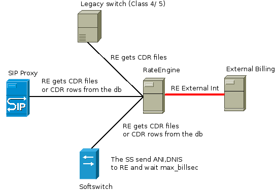

# RateEngine

  A **RateEngine(RE)** is engine for calls/messages calculate and 
online call control (prepaid or postpaid).Can be started as server(daemon) or to use from the console.
The software packet is free and open source solution under GPLv3 license .

* [Introduction](#Introduction)

* [Features](doc/features.md)

* [Installation](doc/install.md)

* [Configurations](doc/config.md)

* [CallControl](doc/integ.md)

* [Software Architecture](doc/arch.md)

## Introduction

  In more cases,the rating engine is part by the billing system.
Sometimes is released as module,sometimes is released as different application.
Always the rating engine is part of entire billing system architecture.
 
  Why **RE** is different apllication ?
The last years appear different billing systems.A lot of telecommunication companies start to develop
own billing system or upgrade exact billing systems.In the same billing system still include not only voice service.
The billing system is not only application for money collecting,payment statistics and reports.
Make more from this - manage same services.Start and stop the service,modify settings,etc.
This system is interface into different services,servers,platforms.
For example: Internet,IPTV,VOIP are different services. Usualy are released over different platforms.
No problem to use one billing system and general interface from this system.
But call/message rating is specific action.Should be had learning and experience.
Therefore is this release.In your conception,the RateEngine will release the call rating and if you need,can be used the call control.

You can see example topology for RateEngine using in the follow picture:

  A **RE** get need records from definited servers as files or from databases.
Determine her **BillPlan** and **Tariff** is current call.
Calculate and save in balance.Can be used **FreeBillsec** per difined tariff.
Can be used **TimeConditions** per tariff - different prices in different time zone.
The **RE** to be managed by external **BillingSystem** with APIs or other external interface.
If you want to use CallControl - prepaid or credit limit(postpaid),then the RE will return 'maxsec'.
Can be used 'maxsec' as RTP timeout or other param in you call managment.

