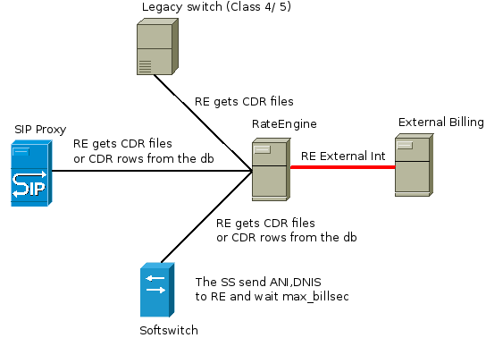

# [ RateEngine ]

A **RateEngine(RE)** is engine for calls calculate and online call control.
Can be started as server(daemon) or to use from the console(one time).


RE взема нужните записи от описаните сървъри под формата на файлове или от база данни. Намира кой разговор на кой потребител е. 
Определя неговият билинг(тарифен) план и по коя от тарифите е този разговор. 
Допълнително към тарифирането има възможност за времево зониране(сегментиране),
както и гъвкъв механизъм за пресмятане (пресмятащи функции). 
Към всяка тарифа или група от тарифи може да има безплатни минути.Плановете могат да имат период на действие. 
Същата възможност имат и тарифите. 
Това дава възможност за промоции с определен период на действие,след който влиза в действие друг план или тарифа .

A **RE** get need records from definited servers as files or from databases.
... Finds her BillPlan (group from tariffs)


  В повечето случаи  рейтинг машината е част от билинг системата . Понякога е реализирана като модул,а друг път като самостоятелно приложение, но функциониращо като част от цялата архитектура на билинг системата .

 In more cases,the rating engine is part by billing system.
Sometimes is released as module,sometimes is different application.
But the rating engine is part of entire billing system architecture.
 

 Why **RE** is different apllication ?

 Последните години се появиха различни билинг системи. 
Много от фирмите в телекомуника-циите започнаха сами да пишат или надграждат съществуващи системи. 
В самите билинг системи вече са включени много услуги - не само гласови, като освен това тези приложения вече са интегрирани със самите услуги. 
Те предлагат нещо повече от плащания и справки.Билинг приложенията вече управляват услугите. 
Пускат, спират и правят настройки по тях. На практика те се превърнаха в интерфейс към много други приложения, 
работещи за различни услуги и функционалностти . Например Internet, IPTV, VoIP са различни по характеристики услуги.Обикновенно са реализирани върху различни платформи. Не пречи обаче да се управляват от една система, единен интерфейс. И в много от случайте  това е точно билинга. В цялата тази схема, рейтването е една част, една функционалност. Рейтването на разговори обаче е специфична дейност . Нужни са познания и опит . Тъй като тази фукционалност е замислена като самостоятелно приложение са добавени възможностти за интегриране към съществуващите билинг системи . RateEngine ще работи на заден план като част от цялата билинг система. В зависимост от използваният softswitch ще може да осигури и Call Control за да могат да се реализират prepaid  или credit control на postpaid услуги . С предоставените API-та може да  се интегрират настройките към конкретен билинг. Ако това не е необходимо може да се използва собственият интерфейс на машината и тя да се настройва като самостоятелно приложение  извън дадената билинг система .

   RE може да обслужва няколко сървъра едновременно, но не може един акаунт(потребител) да се използва на няколко сървъра т.е. потребителят е обвързан с конкретен CDR сървър!!!

The **RE** is released as moduler software - every functionality is different module.
For example: TCP support - tcp module (tcp.so) or pgsql support - pgsql module(pgsql.so). 
Main modules are: CDRMediator (cdrm.so),Rating (rt.so) and CallControl (cc.so).


  На фиг.1 е начертана обща схема . Целта е да се придобие впечатление, къде в топологията се намира приложението. По – нататък като CDR сървър се има предвид всички видове устройства и приложения, които поддържат записи – CDRs  като  Class 4 /5 switches , SIP Proxies , Softswitches , Media Gateways , Session Border Controllers  .

You can see example topology for RateEngine using in follow picture:

<div alight="center"

<div alight="center">Fig.1</div>
/div>

## RateEngine components

### RateEngine core (libre7core.so)

In the RateEngine core are defined few system interfaces:

#### **mod**

#### **db**

#### **net**

#### **mem**

#### **config**

#### **misc**

#### **log**


### CDRMediator module (cdrm.so)

### Rating module (rt.so)

### CallControl (cc.so)

## RateEngine installation

Steps are follow:

```git clone https://github.com/dkokov/RateEngine.git```

cd src/

edit file 'config.md' and comment/uncomment modules

make

make install


