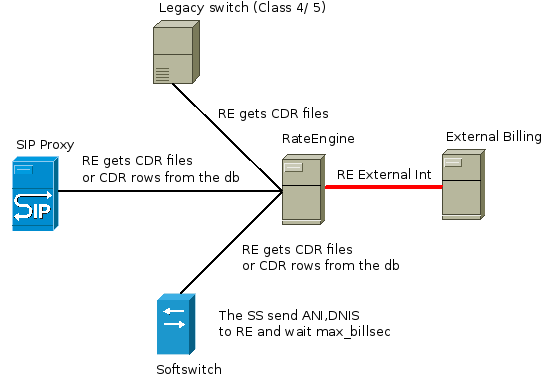

# RateEngine

**A fast, modular rating and online call-control engine for telecom billing.**

  **RateEngine (RE)** rates calls and messages and, optionally, controls them in
real time (prepaid or postpaid). Written in C, it runs as a server (daemon) or
straight from the console, and plugs into your existing billing system through
its APIs. Free and open source under the [GPLv3](https://opensource.org/licenses/GPL-3.0)
license.

## Key features

* **Modular** — load only what you need (rating, CDR mediation, call control,
  transports, database engines) as runtime plugins.
* **Multi-database** — PostgreSQL, MySQL, Redis, MongoDB and embedded DuckDB
  behind one storage abstraction.
* **Two rating engines** — classic per-CDR rating, or **DuckDB batch rating**
  that prices thousands of CDRs per cycle in a single analytical pass.
* **Flexible pricing** — nested bill plans, longest-prefix match, multi-tier
  tariffs, time conditions (peak/off-peak) and free-seconds allowances.
* **Online call control** — prepaid / credit-limit enforcement returning a
  `maxsec` per call, integrable with FreeSWITCH, Asterisk and others.
* **CDR mediation** — import CDRs from external databases or CSV files via
  per-source profiles.

## Documentation

* [Software Architecture](doc/arch.md)
* [Features](doc/features.md)
* [Installation](doc/install.md)
* [Configuration](doc/config.md)
* [CDRMediator](doc/cdrm.md) · [Rating](doc/rating.md) · [CallControl](doc/call_control.md)

## How it works

  RE pulls the CDRs it needs from external servers (files or databases),
determines each call's **BillPlan** and **Tariff**, calculates the charge and
updates the balance — applying **FreeBillsec** and **TimeConditions** per tariff
where configured. An external **BillingSystem** drives it through APIs. When
call control is enabled, RE returns a `maxsec` you can use as an RTP timeout or
other guard in your call flow.

## Feedback

  Questions, ideas or bugs? Open an issue: [ISSUES](https://github.com/dkokov/RateEngine/issues)

For private help or consulting, reach me directly: dkokov75 at gmail dot com
