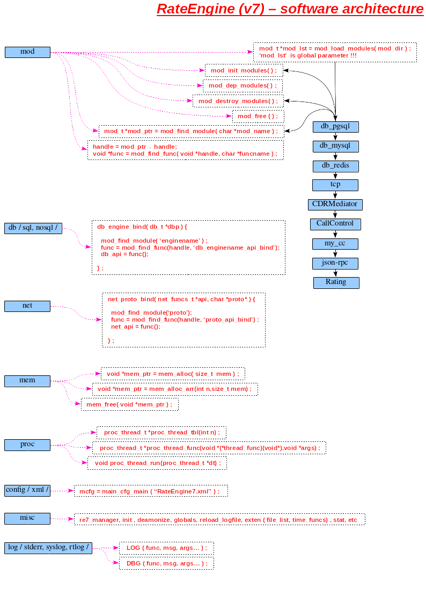

# Software architecture

  The **RE** is released as moduler software - every functionality is different module.
The modules are share library(.so) files. Use dynamic load(dl) conception of Linux.
For example: TCP support - tcp module (tcp.so) or pgsql support - pgsql module(pgsql.so).
Main modules are: CDRMediator (cdrm.so),Rating (rt.so) and CallControl (cc.so).
If you want to use PGSQL,then should use 'pgsql.so'.And you want to use MSQL,then should use 'mysql.so'. 




### RateEngine core (libre7core.so)

In the RateEngine core are defined few system interfaces:

#### **mod**
All is start with this interface,because it has to get defined modules in the main config.
Load every module,check for init function,check for depends and push in the modules list.
Main C struct in this interface is 'mod_t':

```C
typedef struct mod {
    /* module name */
    char mod_name[MOD_NAME_LEN];
    
    /* module version */
    unsigned short ver;	
    
    /* init function in the module */
    mod_func_init_f init;
    
    /* destroy function in the module */
    mod_func_destroy_f destroy;
    
    /* module depends list */
    mod_dep_t *depends;
    
    /* dl(.so) file pointer after file opening */
    void *handle;
	
    /* a pointer to next 'mod struct' from the 'mod list' */
    struct mod *next;
} mod_t;
```

After stop,the interface check for destroy function,call it and close the dynamic library (.so),
who is opened before (in starting).

#### **db**

#### **net**

#### **mem**

#### **proc**

#### **config**

#### **misc**

#### **log**


### CDRMediator module (cdrm.so)
  The **CDRMediator** module gets CDR from database table or from CSV file.Will work with several servers.
You have to definite in the configuration.

### Rating module (rt.so)
  The **Rating** module is main module,because it release rating model.
What does calculate/Who is billing plan and all other settings into plan and etc.
It's realy rating model.
  This module is depended by the CDRMediator,because should get CDRs from the db.

### CallControl (cc.so)
  The **CallControl** module is real time communication between the RE and same SoftSWITCH/SIP Proxy/etc voice solution.
Depends by CDRMediator,Rating modules.The **CallControl server** keeps all currently connections as status.
When a call is finished,then a **CallControl** delete this connection status and call rating function will calculate a call.
Last to update a current balance.


