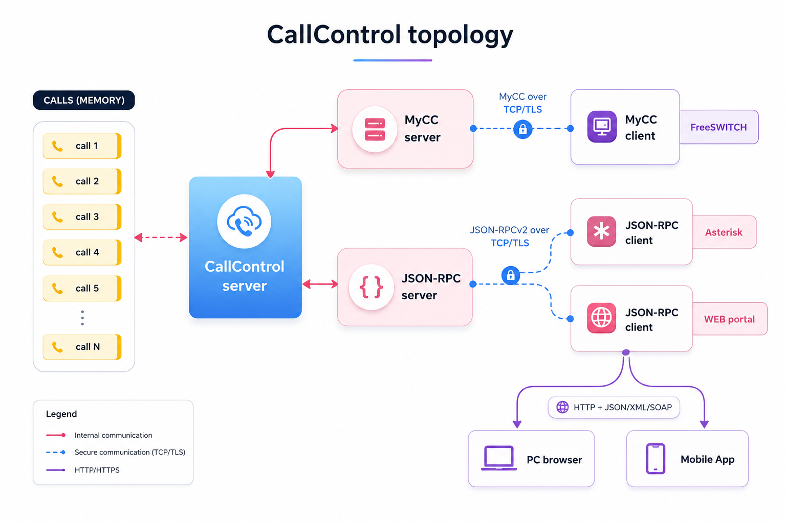

# CallControl

  Very important possibility in the RateEngine gives a CallControl.
You can be released prepaid or postpaid in your voice platform.In the RateEngine has a CallControl module,
but as feature there is a process,not only module.
In the same CallControl process are using functionalities by entire RateEngine (Rating,CDRMediator,MyCC or JSON-RPC over UDP/TCP/SCTP/TLS,etc).

  When you are releasing prepaid,the CallControl is following whether a prepaid amount is reaching to defined amount per this subscriber.
When this amount is reached,then the CallControl deny calls per this subscriber.

  For prepaid or postpaid release per Subscriber is using a [PaymentCardManagment](features.md#PaymentCardManagment).

## Server model

Each CallControl interface runs a **parallel worker-pool server** (in the `net`
layer, `net_parallel_server`): one acceptor thread hands accepted connections to
a fixed pool of worker threads. Pool size is `CCWorkers` (default 8); **each
worker owns its own DB connection**, so requests are rated concurrently. A single
janitor thread (`cc_server_thread`) performs term-time work (CDR insert +
rating) and call-table cleanup.

Online charging (`maxsec`) is computed by the **Rating** module (`rt.so`) via its
`rt_maxsec` entry - full pcard + rate + tariff + time-conditions + credit-limit +
sim/shared-pcard restriction - reusing the same shared reference cache as the
batch path, so `rt.so` must be loaded whenever CallControl is active.

## Call lifecycle

* **maxsec** - authorize a call: returns the max seconds allowed. On success the
  call is held in the in-memory call table until `term`.
* **term** - end the call: the janitor inserts the CDR, rates it inline
  (marking it processed so the offline batch rater won't re-rate it), and clears
  the table entry.

Negative `maxsec` values are decision codes (e.g. no billing account, no pcard,
no credit, or `-6` = concurrent-call / shared-pcard restriction).

## Transports

The wire protocol is chosen per interface (config in `IntConfigDIR`), decoupled
from the transport (`tcp`, ...):

* **my_cc** - compact CSV request/response.
* **jsonrpc_cc** - JSON-RPC 2.0 (`maxsec`, `term`, `state`, and stubs for
  `balance` / `rate` / `cprice`). Raw TCP - test with `nc`, not HTTP `curl`.

Multiple interfaces can run at once (e.g. `my_cc` on 9090 and `jsonrpc_cc` on
9091), each with its own worker pool.

The transport (`proto`) is independent of the wire protocol: any of the above can
run over `tcp` or `tls`. For `tls` the interface config adds `cert`/`key` (PEM) and,
optionally, mutual TLS via `verify-client="yes"` + a `ca` bundle — each interface
has its own certificate and verify policy. See [cc_int_prof.md](cc_int_prof.md) for
the params; generate a test PKI with `src/scripts/gen_tls_cert.sh`.

See [cc_commands.md](cc_commands.md) for the console command reference (my_cc and
jsonrpc_cc request/response formats, plus the TLS variants).

See more information for some CallControl integrations :

* [FreeSWITCH CallControl Integration](fs_cc.md)

* [Asterisk CallControl Integration](ast_cc.md)