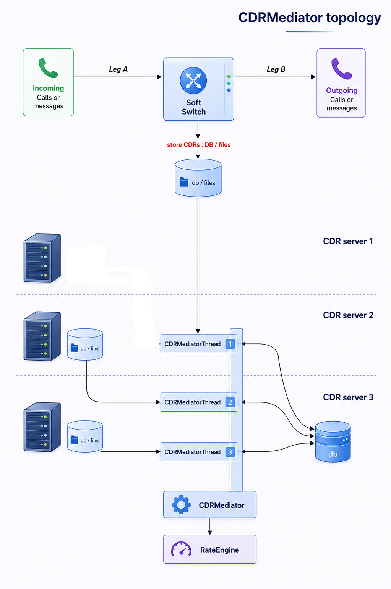

# CDRMediator

  To rate calls you first need the call records - **CDRs**. One approach is to
write CDRs straight into the RateEngine database, but it is usually cleaner to
keep them in the source system and pull them in when needed.

  For example, FreeSWITCH stores its CDRs in a database or as CSV files. When it
is time to rate, the **CDRMediator** fetches those records from the source,
optionally filters and normalizes them, and writes them into the RateEngine
`cdrs` table for the **Rating** module to price.

  If you don't need this (your CDRs are already in the RateEngine DB) you don't
have to start the CDRMediator - but the module must still be loaded, because the
**Rating** module uses functions exported by it.

  The **CDRMediator** can serve several CDR sources at once. Each source has its
own CDR profile and its own `CDRMediatorThread`, and each thread opens its own
connection to the RateEngine database. Three sources means three profiles and
three threads.

See [CDR Profile Example](cdr_profile.md) for how to describe a source.
