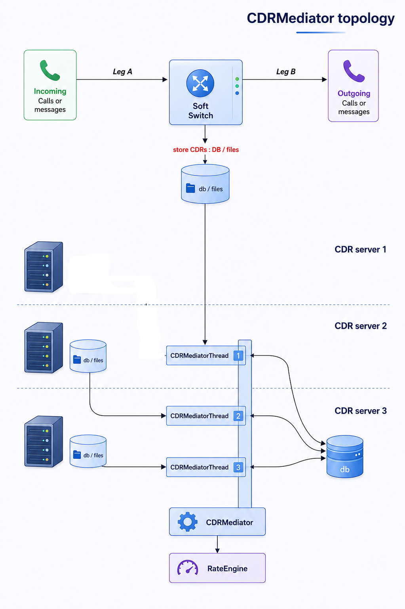

# CDRMediator

  To rate calls you first need the call records - **CDRs**. One approach is to
write CDRs straight into the RateEngine database, but it is usually cleaner to
keep them in the source system and pull them in when needed.

  For example, FreeSWITCH stores its CDRs in a database or as CSV files. When it
is time to rate, the **CDRMediator** fetches those records from the source,
optionally filters and normalizes them, and writes them into the RateEngine
`cdrs` table for the **Rating** module to price.

  If you don't need this (your CDRs are already in the RateEngine DB) you don't
have to start the CDRMediator - but the module must still be loaded, because the
**Rating** module uses functions exported by it.



  The **CDRMediator** can serve several CDR sources at once. Each source has its
own CDR profile and its own `CDRMediatorThread`, and each thread opens its own
connection to the RateEngine database. Three sources means three profiles and
three threads.

See [CDR Profile Example](cdr_profile.md) for how to describe a source.


## How ingestion writes to `cdrs`

* **Autocommit per row** - each CDR is committed as it is inserted, so it is
  visible immediately and the **Rating** module can price it concurrently; an
  interrupted run loses only the last row (not the whole batch).
* **Dedup** - the `cdrs.call_uid` UNIQUE constraint plus `INSERT ... ON CONFLICT
  DO NOTHING` (PostgreSQL) / `INSERT IGNORE` (MySQL) skip already-imported CDRs,
  so re-running a cycle is safe and effectively resumable.
* **Watermark** - a DB source records its position in `cdr_storage_sched`. The
  first poll backfills from `SchedTS`, then the watermark advances toward *now*
  and the source is polled for new CDRs each cycle.
* **Bounded memory (DB sources, pgsql)** - the remote read is streamed through a
  server-side cursor in chunks of `fetch-chunk` rows (default 50000), so a large
  backfill does not materialize the whole result set in memory. A progress line
  is logged every 100000 inserts.


## Performance tuning

Two database/engine settings dominate ingestion speed; set both for bulk loads:

* **`synchronous_commit = off`** on the RateEngine database - removes the
  per-row fsync (the biggest cost of autocommit). Set it so the **daemon's**
  connections inherit it (a psql-session `SET` does *not* reach the daemon):

  ``` SQL
  ALTER DATABASE rate_engine SET synchronous_commit = off;   -- then restart RE
  ```

  This is safe for integrity (it is *not* `fsync=off`); on a power/OS crash only
  the last fraction of a second of commits can be lost, and CDR ingestion is
  re-pullable from the source via the watermark anyway.

* **`LogDebugLevel = 2`** in `RateEngine7.xml` - at level >= 3 every SQL
  statement is logged, which for a multi-million-row backfill writes hundreds of
  MB and dominates wall-clock time. Level 2 keeps warnings/errors and the
  progress/summary lines (those use `LOG`, printed at any level).

* **`fetch-chunk`** (profile param, default 50000) - rows per remote cursor
  `FETCH`. Peak memory is roughly `fetch-chunk x columns x 255 bytes`; lower it
  for tighter RAM, raise it for fewer round-trips.


### Measured results

Backfill of **2,087,790** CDRs, DB source -> local `cdrs`, PostgreSQL 15,
source and target on the same host (test setup - your numbers will vary):

| Configuration | ms / CDR | CDR / s | ~2.09M backfill | Peak memory | Log written |
|---|---:|---:|---:|---:|---:|
| `synchronous_commit=on`, `LogDebugLevel>=3` | ~1.26 | ~790 | ~44 min | ~5 GB | ~250 MB |
| `synchronous_commit=off`, `LogDebugLevel=2` (full fetch) | ~0.28 | ~3540 | ~9.8 min | ~5 GB | tiny |
| `synchronous_commit=off`, `LogDebugLevel=2`, chunked cursor (default) | ~0.26 | ~3800 | ~9.1 min | **~127 MB / chunk** | tiny |

Takeaways:

* Logging + `synchronous_commit` account for the ~**5x** speed difference.
* The chunked cursor removes the memory ceiling **at no speed cost** - safe to
  point at a 10M+ row source without OOM.
* At ~3800 CDR/s, steady-state polling is trivial: a 10-minute window of even
  100k CDRs is ingested in ~30 s, far inside a typical `getCDRsInterval`.
