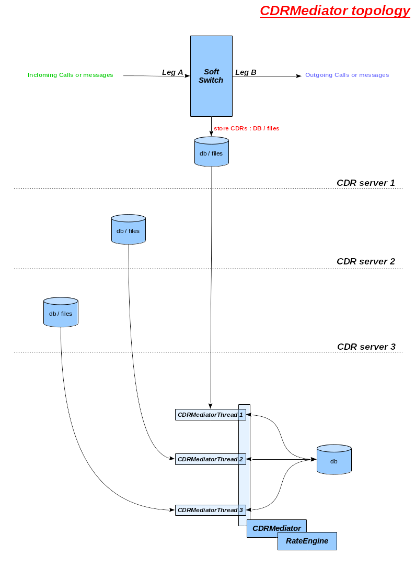

# CDRMediator

  If you would like calculate your calls,should be had records - CDRs.
Usualy Rating models are working such.Can be save these records directly to the RateEngine DB.
I think that better variant is to save CDR in different databases or files not directly.
For example: You are using FreeSWITCH and save CDRs into DB or csv files.
When you want to calculate calls,first get these CDRs by FreeSWITCH storege(DB or files).
In this case,you shold be used the **CDRMediator** for this task.
If you would not use this case,don't start CDRMediator,but have to load same module therefore the **Rating** module.
It uses exporting functions by the **CDRMediator** module.

  The **CDRMediator** can works for several CDRs servers.Every server is different CDR profile
and different CDRMediatorThread.If you use three CDRs servers,will be have three CDR profiles and three CDRMediatorThreads.
Every CDRMediatorThread create and use different connection to the RateEngine's DB server.

